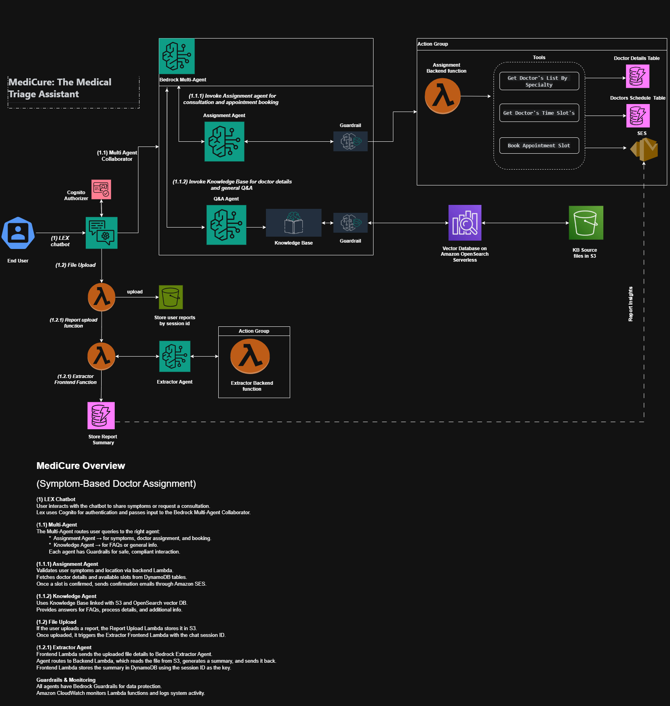

# 🩺 MediCure: The Medical Triage Assistant

**MediCure** is an intelligent medical triage assistant that helps patients connect with the right specialist based on their symptoms, location, and medical history. It combines conversational AI, document processing, and multi-agent collaboration to streamline appointment booking and medical insight extraction.

---

## 🚀 Features

- 💬 **Chatbot Interface**: Patients interact via a web-based UI to share symptoms and ask questions.
- 📄 **Medical Report Upload**: Users can upload PDF reports for automated analysis.
- 🧠 **Clinical Insight Extraction**: Bedrock agents extract summaries from uploaded documents.
- 🩺 **Specialist Matching**: Suggests doctors and appointment slots based on symptoms and location.
- 📧 **Confirmation Email**: Sends structured appointment details via SES.
- ❓ **FAQ Handling**: Routes general questions to a QnA agent powered by a Knowledge Base.
- 🤝 **Multi-Agent Collaboration**: Supervisor agent coordinates routing between specialized agents.

---

## 🧠 Architecture Overview



### 📁 GitHub Repository Structure

```markdown
MediCure/
├── Frontend/                         # Frontend chatbot interface
│   ├── app.js
│   ├── index.html
│   └── style.css
├── Backend/
│   ├── Agents/
│   │   ├── ExtractMedicalReport/     # Agent extracts clinical insights from uploaded reports
│   │   │   ├── Agent_Instruction.txt
│   │   │   └── README.md
│   │   ├── MedicalAssignment/        # Agent for specialist matching and slot availability
│   │   │   ├── Agent_Instruction.txt
│   │   │   └── README.md
│   │   ├── Multi_Collaborator/       # Multi-agent routing config
│   │   │   ├── Agent_Instruction.txt
│   │   │   └── README.md
│   │   ├── QNA_Agent/                # QnA agent for handling FAQs
│   │   │   ├── Agent_Instruction.txt
│   │   │   ├── kb_entries.json
│   │   │   ├── KB_permissions.json
│   │   │   └── README.md
│   │   └── Agent_permissions.json    # IAM permissions for each agent
│   ├── Lambda_functions/
│   │   ├── doctor_assign.py          # Backend logic for specialist matching and slot availability
│   │   ├── extractor_backend.py      # Returns structured content extracted from uploaded PDF file
│   │   ├── extractor_fe.py           # Invokes a Bedrock agent to extract clinical insights
│   │   ├── sendEmail.py              # Sends confirmation email to user
│   │   ├── uploadToS3.py             # Handles file uploads and triggers extraction
│   │   └── Policies/                 # IAM permissions and resource-based policies for Lambda functions
│   │       ├── doctor_assign_lambda_policy.json
│   │       ├── doctor_assign_Resource_based_policy.json
│   │       ├── extractor_backend_lambda_policy.json
│   │       ├── extractor_backend_Resource_based_policy.json
│   │       ├── extractor_fe_lambda_policy.json
│   │       ├── extractor_fe_Resource_based_policy.json
│   │       ├── sendEmail_lambda_policy.json
│   │       └── uploadToS3_lambda_policy.json
├── DynamoDB/
│   ├── medical_summary_schema.json  # DynamoDB table schema for upserting medical summary
│   ├── doctor_schedules_schema.json # DynamoDB table schema for retrieving doctor slot details
│   └── doctors_details_schema.json  # DynamoDB table schema for fetching doctor details by location and specialty
├── README.md
├── MediCure_Architecture.png        # Architecture diagram
```

## 🛠 Technologies Used

| Service                | Purpose                                      |
|------------------------|----------------------------------------------|
| **Amazon Lex**         | Conversational interface                     |
| **Amazon S3**          | Stores uploaded medical reports              |
| **AWS Lambda**         | Backend logic and orchestration              |
| **Amazon Bedrock**     | Agent-based document and conversation AI     |
| **Amazon DynamoDB**    | Stores extracted summaries and session data  |
| **Amazon SES**         | Sends confirmation emails                    |
| **Amazon Cognito**     | User authentication                         |
| **Amazon Guardrails**  | Enforces safety and content filtering        |
| **Amazon OpenSearch**  | Vector store for Knowledge Base              |
| **HTML/CSS/JavaScript**| Frontend chatbot interface                   |

---

## 📦 Lambda Functions

### `uploadToS3.py`

This Lambda function is exposed via a **Function URL** and is triggered directly from the UI when a user uploads a medical report (PDF). It performs the following tasks:

- Handles **CORS preflight** requests for browser compatibility.
- Decodes and stores the uploaded file in an S3 bucket under a session-specific path.
- Triggers the **extraction Lambda** (`extractor_fe`), which invokes a **Bedrock agent** to extract clinical insights from the uploaded report.
- Returns a success response to the UI once the upload and trigger are complete.

**Environment Variables Required**:
- `UPLOAD_BUCKET` → S3 bucket name (e.g., `user-data-agent`)
- `EXTRACTOR_LAMBDA` → Name of the extractor Lambda (e.g., `extractor_fe`)

### `extractor_fe.py`

This Lambda function is triggered after a user uploads a medical report. It invokes a **Bedrock agent** to extract clinical insights from the document and stores the results in **DynamoDB** for later use in confirmation emails and session tracking.

---

#### 🛠 Function Overview

- **Trigger**: Invoked by `uploadToS3.py` after a file is uploaded to S3.
- **Purpose**:
  - Calls a Bedrock agent `ExtractMedicalReport` using the uploaded report's session ID.
  - Parses the agent's streamed response.
  - Stores the extracted summary in DynamoDB under the same session ID.
- **Agent Runtime**: Uses `bedrock-agent-runtime` with retry and timeout configuration.
- **Storage**: Results are upserted into a DynamoDB table (`medical_summary` by default).

---

#### 🧬 Flow Summary

1. Receives `sid` (session ID) from the triggering Lambda.
2. Generates a unique `sessionId` for Bedrock interaction.
3. Sends the session ID as input to the Bedrock agent.
4. Parses streamed response chunks into a usable format.
5. Stores the extracted summary in DynamoDB:
   - If record exists → updates it.
   - If not → inserts a new item.

---

#### Sample DynamoDB Record

```json
{
  "submission_id": "AC4C8675",
  "key_value": [
    "Evidence of mild bronchial inflammation; no signs of infection."
  ],
  "created_date": "2025-10-18T10:15:00Z",
  "last_updated": "2025-10-18T10:15:00Z"
}
```
---

### `extractor_backend.py`

This Lambda function is invoked by the **Bedrock agent** `ExtractMedicalReport` via the action group `extractor_fetch`. It retrieves uploaded PDF files from S3, extracts text using PyMuPDF (`fitz`), and returns the structured content back to the agent for further processing.

---

#### 🛠 Function Overview

- **Trigger**: Called by Bedrock agent through the `extractor_fetch` action group.
- **Purpose**:
  - Locate uploaded PDF files in S3 using the provided `submission_id`.
  - Extract text from each PDF using PyMuPDF.
  - Return the extracted content to the agent in a structured format.
- **Output Format**: JSON containing `submission_id` and a list of extracted documents.

---

#### 📦 Invocation Flow

1. `uploadToS3.py` uploads the PDF to S3 and triggers `extractor_fe.py`.
2. `extractor_fe.py` invokes the Bedrock agent `ExtractMedicalReport`.
3. The agent calls `extractor_backend.py` via action group `extractor_fetch`.
4. This Lambda extracts text from the PDF(s) and returns it to the agent.

---

#### 📄 Sample Response

```json
{
  "response": {
    "actionGroup": "extractor_fetch",
    "function": "extractor_backend",
    "functionResponse": {
      "responseBody": {
        "TEXT": {
          "body": "{\"submission_id\":\"AC4C8675\",\"documents\":[{\"file_name\":\"uploads/AC4C8675/report.pdf\",\"extracted_text\":\"...\"}]}"
        }
      }
    }
  },
  "messageVersion": 1
}
```
### 🩺 `doctor_assign` Lambda

This Lambda function is triggered by the **Medical Assignment Agent** whenever a user interacts with the bot to share symptoms or request specialist matching. It handles the core logic for **doctor discovery**, **timeslot availability**, and **appointment booking**.

---

#### 🧠 Function Overview

- **Trigger**: Invoked by the `MedicalAssignment` Agent via Bedrock's action group routing.
- **Purpose**:
  - Match doctors by specialty and location.
  - Retrieve available timeslots for a selected doctor.
  - Book an appointment and send confirmation email.
- **Session-Aware**: Uses session attributes to track specialty, symptoms, and user details across interactions.

---

#### 🩺 Supported Functions

| Function Name             | Description                                                                 |
|---------------------------|-----------------------------------------------------------------------------|
| `get_doctors_by_specialty`| Finds doctors based on specialty and location. Returns next available slots.|
| `get_doctor_timeslots`    | Retrieves available timeslots for a specific doctor.                        |
| `book_appointment_slot`   | Books a selected slot and sends confirmation email to the user.             |

---

#### 🔄 Invocation Flow

1. **User Interaction**: User shares symptoms or requests a specialist.
2. **Assignment Agent**: Routes request to `doctor_assign` Lambda.
3. **Lambda Logic**:
   - Matches doctors using `specialty` and `location`.
   - Captures symptoms from user input or defaults based on specialty.
   - Retrieves timeslots and books appointments.
   - Fetches medical summary from DynamoDB (via session ID).
   - Sends confirmation email using `sendemail.py`.

---

#### 🧬 Sample Response (Booking)

```json
{
  "response": {
    "actionGroup": "assignment",
    "function": "book_appointment_slot",
    "functionResponse": {
      "responseBody": {
        "TEXT": {
          "body": "You have successfully scheduled Slot 3: October 23, 2025 at 09:30 AM with Dr. Sarah Mehta(Pulmonology). Your appointment confirmation ID is: AC4C8675. A confirmation email has been sent to your email address."
        }
      }
    }
  },
  "messageVersion": 1,
  "sessionAttributes": {
    "current_specialty": "Pulmonology",
    "symptoms_summary": "Patient reported: persistent cough and mild chest discomfort"
  }
}
```
---
### 📧 `sendemail.py`

This Lambda function is responsible for sending a **confirmation email** to the patient after a successful appointment booking. It compiles appointment details and extracted medical report insights into a structured HTML email and sends it using **Amazon SES**.

---

#### 🛠 Function Overview

- **Trigger**: Invoked by `doctor_assign` Lambda after appointment confirmation.
- **Purpose**: Sends a personalized email with:
  - Confirmation ID
  - Specialist type
  - Assigned doctor
  - Appointment time
  - Symptoms 
  - Report insights
- **Email Format**: HTML table for clean presentation
- **Email Provider**: Amazon SES (Simple Email Service)

---

#### 📨 Sample Email Output

```text
Dear [User Name],

We are pleased to confirm your medical appointment. Below are the details:

Confirmation ID       AC4C8675  
Specialist Type       Pulmonologist  
Assigned Doctor       Dr. Sarah Mehta 
Appointment Time      October 23, 2025 at 09:30 AM IST 
Symptoms              Persistent cough and mild chest discomfort  
Report Insights       Evidence of mild bronchial inflammation; no signs of infection.

Thank you,  
Healthcare Support Team
```
---

#### ⚙️ Environment Variables Required

| Variable        | Description                          | Example                  |
|----------------|--------------------------------------|--------------------------|
| `REGION`       | AWS region for SES                   | `us-east-1`              |
| `SENDER_EMAIL` | Verified sender email in SES         | `yourbotapp@gmail.com`   |

---

#### 📄 Code Highlights

- Uses `boto3.client('ses')` to send email
- Constructs HTML body with inline styling
- Includes robust error handling and logging
- Returns HTTP 200 or 500 with detailed response

---

## 🤖 Bedrock Agents

### 🧠 `ExtractMedicalReport`
- Extracts clinical insights from uploaded reports.
- Uses `extractor_fetch` action group to invoke backend Lambda.

### 🩺 `MedicalAssignmentAgent`
- Handles doctor matching and appointment booking.
- Action group: `doctor_assign` with 3 functions:
  - `get_doctors_by_specialty`
  - `get_doctor_timeslots`
  - `book_appointment_slot`

### ❓ `QNA_Agent`
- Answers system-related questions using `Medical_KB`.
- Powered by Bedrock Knowledge Base with OpenSearch vector store.

### 🤝 `Multi_Agent`
- Supervisor agent coordinating routing between:
  - `MedicalAssignmentAgent`
  - `QNA_Agent`
- Uses collaborator instructions and routing logic.

---

## 🔐 IAM & Guardrails

- Each agent has a dedicated IAM role with scoped permissions.
- Guardrail: `Medical_Gaurdrail` applied to all agents.
  - Blocks hate, violence, sexual, insults, and misconduct content.
  - Uses high-strength filters and custom blocked messaging.

---

## 📚 Knowledge Base

| Property              | Value                                  |
|-----------------------|----------------------------------------|
| **Name**              | `Medical_KB`                           |
| **Storage**           | S3 (`kb_entries.json`)                 |
| **Embedding Model**   | Titan Text Embeddings v2               |
| **Vector Store**      | Amazon OpenSearch Serverless           |
| **Index Name**        | `bedrock-knowledge-base-default-index` |

Used by `QNA_Agent` to answer document, process, and system-related questions.

---
## 🤖 Amazon Lex Configuration: MedicalTriageBot

This section outlines the steps to configure the **MedicalTriageBot** in Amazon Lex.

### Bot Details
- **Bot Name**: `MedicalTriageBot`
- **Description**:  
  MedicalTriageBot is a patient-facing triage chatbot. It gathers patient symptoms or accepts a report upload link, asks clarifying questions when needed, and hands off the medical text to backend Bedrock Agents for clinical reasoning.  
  The bot's primary responsibilities are to:
  - Capture patient input reliably
  - Guide users through needed clarification
  - Call a Lambda fulfillment that routes content to a Bedrock Agent for:
    - Specialty mapping
    - Doctor assignment
    - Available slot confirmation
    - Summary generation  
  > ⚠️ The bot must be used for routing and **not** for definitive clinical diagnosis.

### IAM Permissions
- Create a role with **basic Amazon Lex permissions**.

### Error Logs
- Enable error logging.

### Session Settings
- **Idle Session Timeout**: `5 minute(s)`

### Language
- Select: `English (US)`

### Intent Configuration
1. **Add Intent**:
   - Use built-in intent: `AMAZON.BedrockAgentIntent`
   - Intent Name: `BedrockIntegration`

2. **Configure BedrockAgentIntent**:
   - Select Bedrock Agent
   - Provide:
     - **Bedrock Agent ID**
     - **Agent Alias ID** of the `Multi_Collaborator` agent

3. Click **Build** to compile the bot.

4. Once built, you can **test** the bot directly in the Lex console.

---

## 📌 Setup Instructions

1. **Clone the repository**:
   ```bash
   git clone https://github.com/chanchal1902/medicure-healthbot.git
   cd MediCure

2. **Deploy Lambda functions**:

- Upload Lambdas via AWS Console or CLI.
- Create and assign IAM role and resource based policy using permissions attached in MediCure\Backend\Lambda_functions\Policies for each lambda.
- Enable function URL in configuration of lambda `uploadToS3`

3. **Provision AWS resources**:

Create S3 buckets for file uploads and static site hosting.
Bucket 1: user-data-agent # For file upload
Bucket 2: med-triage-ui   # For static web hosting

Set up DynamoDB tables using schema.json.(Please refer MediCure\DynamoDB)

4. **Configure Lex bot**:

Set up Lex bot with Multi Collaborator agent.
Please refer Amazon Lex Configuration explained above.

5. **Create Bedrock Agents and Knowledge Base**:

Configure Bedrock agents using the provided instructions in each agent folder.
Please refer MediCure\Backend\Agents

6. **Create IAM role for agents**:

Set up IAM roles and permissions from MediCure\Backend\Agents\Agent_permissions.json.

7. **Upload Knowledge Base**

Upload Knowledge Base documents to S3 (user-data-agent/KB/kb_entries.json).
Please refer MediCure\Backend\Agents\QNA_Agent\kb_entries.json

8. **Launch the UI**:

- Open ui/index.html locally or host via S3.

  Static website hosting via S3:
  - Upload files from MediCure\Frontend in s3 bucket "med-triage-ui"
  - Ensure public access is enabled in s3 configuraton.
  - Enable S3 static website hosting
  - Select hosting type as "Host a static website"
  - Specify Index document as "index.html"
  - Setup bucket policy :
    ```json
    {
      "Version": "2012-10-17",
      "Statement": [
          {
              "Sid": "PublicReadGetObject",
              "Effect": "Allow",
              "Principal": "*",
              "Action": "s3:GetObject",
              "Resource": "arn:aws:s3:::med-triage-ui/*"
          }
      ]
    }
    ```
  - Once the S3 bucket is configured for static website hosting, the website endpoint will be available under the **Properties** tab.
  - You can use this endpoint to access the deployed web application.

- Update Lex bot id, Lex bot alias id, Cognito Pool id in app.js.
- Ensure API endpoint(Lambda Function URL) is correctly configured in app.js.